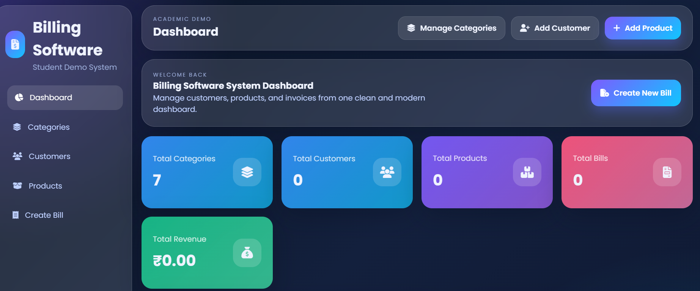

# Billing Software

A web-based Billing Software developed using Django and Python.

## Features

- Customer management
- Product management
- Billing and invoice management
- Database management
- Simple and user-friendly interface

## Technologies Used

- Python
- Django
- HTML
- CSS
- SQLite
## Project Structure

```text
BillingSoftware/
│
├── BillingSoftware/
├── billing/
├── manage.py
├── README.md
└── requirements.txt
```

## Project Screenshot




